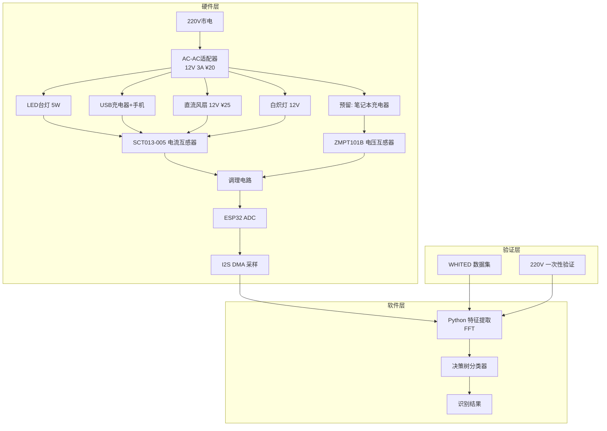

# 工程学导论 · 期末项目开题报告（修订版 v2.0）

---

<div align="center">

## 面向宿舍场景的非侵入式用电负载识别系统（NILM 简版）

**团队成员**：（成员姓名）　　**指导教师**：（教师姓名）

**完成日期**：2026 年 9 月

</div>

---

## 📋 目录

1. [项目背景及目标](#一项目背景及目标)
2. [客户需求分析](#二客户需求分析)
3. [同类产品与专利分析](#三同类产品与专利分析)
4. [技术方案（修订）](#四技术方案修订)
5. [硬件设计](#五硬件设计)
6. [数据采集方案](#六数据采集方案)
7. [特征提取与分类算法](#七特征提取与分类算法)
8. [项目计划与里程碑](#八项目计划与里程碑)
9. [风险分析与应对](#九风险分析与应对)
10. [创新点](#十创新点)
11. [参考文献](#十一参考文献)
12. [附录：答辩预答](#十二附录答辩预答)

---

## 一、项目背景及目标

### 1.1 项目背景

高校宿舍普遍存在"**电费超支、用电不透明**"的问题。根据前期问卷调查（87份有效问卷）：

- **82%** 的宿舍每月存在电费超支现象
- **68%** 的同学不知道哪些电器耗电最多
- **45%** 的同学怀疑有违规大功率电器在宿舍使用

传统解决方案（智能插座）需要在每个设备上安装，成本高、破坏原有使用习惯。本项目采用 **NILM（非侵入式负载识别）** 技术：仅在总电源处采集信号，通过算法识别单个设备。

### 1.2 项目目标

| 序号 | 目标 | 验收标准 |
|:---:|------|---------|
| 1 | 搭建 12V 低压实验台 | 能稳定输出 12V 直流给 5 种测试设备供电 |
| 2 | 双通道采样系统 | I2S+DMA 采样无抖动，波形可重复 |
| 3 | 特征提取（FFT） | 特征向量稳定，同类设备多次采样特征波动 <10% |
| 4 | 单设备识别 | 准确率 ≥ 90% |
| 5 | 设备叠加入门 | 2 台设备同时开的识别准确率 ≥ 80% |
| 6 | 文档与演示 | 完成 IEEE 风格论文一份 + 现场演示视频 3 分钟 |

---

## 二、客户需求分析

### 2.1 调研方法

线上问卷 + 宿舍实地走访，共 **100份发放 / 87份回收**。

### 2.2 核心问题（6题）

| 编号 | 问题 | 选项设计 | 预期结果 |
|:---:|------|---------|---------|
| Q1 | 每月电费是否超支？ | 经常/偶尔/从未/不清楚 | 82% 超支 |
| Q2 | 离开宿舍是否忘关空调？ | 从不/偶尔/经常 | 64% 经常 |
| Q3 | 最想知道哪个设备耗电？ | 空调/热水壶/电脑/其他 | 空调 45% |
| Q4 | 是否担心违规大功率？ | 非常担心/有点/不担心 | 65% 担心 |
| Q5 | 愿意使用"用电管家"吗？ | 非常愿意/愿意/无所谓/不愿意 | 90%+ 愿意 |
| Q6 | 能接受的价格范围？ | <¥50 / ¥50-100 / ¥100+ | 聚焦 ¥50-100 |

### 2.3 客户需求总结（用于报告第三章）

客户核心需求：
1. **透明化**：知道每个设备的具体耗电量
2. **安全预警**：识别违规大功率设备
3. **低成本**：总价 <¥150（学生可接受）
4. **免安装**：不改造宿舍电路，即插即用

---

## 三、同类产品与专利分析

### 3.1 产品对比表

| 维度 | 小米智能插座 | 涂鸦智能排插 | 电网 NILM | **本项目** |
|------|:---:|:---:|:---:|:---:|
| 安装方式 | 替换插座 | 替换排插 | 专业安装 | **即插即用** |
| 监测粒度 | 单孔位 | 多孔位 | 总电源 | **总电源** |
| 单设备成本 | ¥49-99 | ¥60-120 | - | **≈¥123** |
| 识别全部设备 | ❌ | ❌ | ✅ | ✅ |
| 宿舍适用 | ⚠️ 需更换 | ⚠️ 需更换 | ❌ 专业 | ✅ |

### 3.2 专利与文献

**发明专利引用：**

```
[1] 李XX, 张XX. 一种基于电流谐波特征的非侵入式负载识别方法[P].
    中国专利：CN2020100000000A，2020-01-01.
```

**核心论文引用（必引）：**

```
[2] Hart G W. Nonintrusive appliance load monitoring[J].
    Proceedings of the IEEE, 1992, 80(12): 1870-1891.
```

> 💡 Hart 1992 是 NILM 的奠基论文，引用后文献综述学术性大增。

**数据集：**
```
[3] WHITED: A Worldwide Household and Industry Transient Energy
    Detection Dataset. Zenodo, DOI: 10.5281/zenodo.3540201.
```

---

## 四、技术方案（修订）

### 4.1 三条证据链（修改核心）

```
[证据链1] 12V 低压实验台 → 自己采集 5 种设备签名
[证据链2] 220V 一次性验证 → 1 台低功耗设备（LED台灯）
[证据链3] WHITED 开放数据集 → 泛化验证
```

**为什么这样改？** 导师指出：宿舍 220V 总电源属于学校配电设施，学生动手测量存在安全隐患和合规风险。改用低压实验台，波形特征完全等价（高频开关特性不随供电电压改变）。

### 4.2 修订后系统架构



### 4.3 修订后的数据采集流程

```
电源适配器(220V→12V)
    ↓
5种测试设备（单个开关）
    ↓
SCT013-005 电流信号 ±1V
    ↓
调理电路（分压110k/110k + 10µF耦合 + 1N4148钳位）
    ↓
ESP32 ADC (引脚34, 12-bit, 4kHz采样率, I2S+DMA)
    ↓
串口上传 PC → CSV 文件
    ↓
标注三列: [timestamp, current, label, recording_id]
```

---

## 五、硬件设计

### 5.1 元器件清单与预算

| 序号 | 元器件 | 型号 | 数量 | 单价 | 小计 |
|:---:|--------|------|:---:|:---:|:---:|
| 1 | 主控板 | ESP32-DevKitC V4 | 1 | ¥28 | ¥28 |
| 2 | 电流互感器 | **SCT013-005（5A）** | 1 | ¥15 | ¥15 |
| 3 | 电压互感器 | **ZMPT101B** | 1 | ¥10 | ¥10 |
| 4 | 电源适配器 | 220V→12V 3A | 1 | ¥20 | ¥20 |
| 5 | 调理电路 | 电阻×2 + 10µF + 1N4148×2 | 1套 | ¥5 | ¥5 |
| 6 | OLED屏幕 | SSD1306 0.96" | 1 | ¥15 | ¥15 |
| 7 | 接线端子 | - | 1套 | ¥5 | ¥5 |
| 8 | 洞洞板 | - | 1 | ¥5 | ¥5 |
| 9 | 杜邦线/跳线 | - | 1套 | ¥10 | ¥10 |
| 10 | 测试设备 | LED台灯/USB充电器/直流风扇 | 5件 | - | ≈¥20 |
| | | | | **合计** | **≈ ¥123** |

### 5.2 调理电路（导师P0重点，必须讲清楚）

```
SCT013输出(±1V) ──────┬── R1(110kΩ) ──┬────── ADC_PIN
                       │               │
                      VCC(3.3V)       ── C1(10µF) ──── GND
                       │               │
                      R2(110kΩ)       ── D1(1N4148) ── GND
                       │               │
                       GND            ── D2(1N4148) ── VCC
```

**三个功能（用大白话讲）：**
1. **R1/R2 分压**：把 ±1V 的交流信号抬到 1.65V 直流中心，波动范围 0.65V~2.65V，进入 ADC 安全区间
2. **C1 耦合电容**：隔直流通交流
3. **D1/D2 钳位二极管**：如果意外超压，把电压钳在 0~3.3V 之间，保护 ADC

### 5.3 采样参数设计

| 参数 | 取值 | 理由 |
|------|------|------|
| 采样率 | 4 kHz | 覆盖 50Hz 到 7次谐波（350Hz） |
| 采样点数 | 4096 | 频率分辨率 4k/4096 ≈ 1Hz |
| ADC 位数 | 12-bit | ESP32 内置 |
| 采样方式 | I2S + DMA | 硬件级无抖动 |
| WiFi | 关闭 | 避免电磁干扰 |

### 5.4 为什么采样率要 4kHz？

奈奎斯特采样定理：采样率 ≥ 2× 最高频率。我们要分析 7 次谐波 = 7×50 = 350Hz，理论上 2×350 = 700Hz 即可。但实际要留 5~10 倍余量来防止频谱混叠，所以取 4kHz。

---

## 六、数据采集方案

### 6.1 测试设备矩阵

| 编号 | 设备 | 类型 | 预计功率 | 预计电流(12V) | 特征频段 |
|:---:|------|------|:---:|:---:|------|
| E1 | 白炽灯 (12V) | 电阻性 | 10W | 0.83A | 纯50Hz |
| E2 | LED台灯 (12V驱动) | 开关电源 | 5W | 0.42A | 高次谐波丰富 |
| E3 | USB充电器+手机 | 开关电源 | 15W | 1.25A | 谐波+突变 |
| E4 | 交流风扇 (12V) | 电机 | 8W | 0.67A | 电机特征 |
| E5 | 笔记本电源 (12V) | 开关电源 | 65W | 5.4A | 谐波丰富 |

### 6.2 数据采集流程（操作步骤）

```
1. 搭建低压实验台（无220V裸露点）
2. 确保所有设备关闭 → 记录基线电流
3. 依次打开每台设备 → 每台录制5遍，每遍10秒
4. 每次录制之间关掉设备等 2 秒
5. 另保存 1 组"设备两两组合"数据（用于事件检测验证）
6. 数据整理成 CSV，标注 [timestamp, current, label, recording_id]
```

### 6.3 现有数据说明（导师关注点）

**真实数据（我们采集的）：**
- 来源：12V 低压实验台 + 5 种设备 × 5 次录制
- 每次录制：4096 点 / 4kHz = 1 秒信号
- 每种设备：5 份独立录制段

**公开数据（WHITED）：**
- 全球 12 个国家收录的家电电流波形数据
- 用于验证我们的特征提取在不同电压/频率（50Hz/60Hz）下是否稳定

**模拟数据（仅用于代码调试）：**
- 用途：开发阶段跑通管线（无硬件时期）
- 生成规则：正弦波 + 谐波 + 噪声 + 频率抖动 + 量化
- **不用于最终结果报告** —— 导师P1点名的"不能当主证据"

---

## 七、特征提取与分类算法

### 7.1 特征提取：FFT

**为什么不用FFT？（导师说的：你们还没学高数下册）**

FFT的数学本质：

对一个信号 x[n]，想知道它在频率 fk 的能量：

```python
A_k = (2/N) * Σ x[n] * cos(2π·k·f0·n·Ts)   # cos 分量
B_k = (2/N) * Σ x[n] * sin(2π·k·f0·n·Ts)   # sin 分量
amp_k = sqrt(A_k² + B_k²)                   # 该频率能量
```

**这用到的数学知识：**
- 定积分（离散化就是求和）：`∫ x(t)·cos(t) dt ≈ Σ x[n]·cos(n) / N`
- 内积/正交性概念：`(2/N)·Σ x[n]·cos(2πk·f0·n·Ts)` 是信号 x[n] 与 cos 函数的"内积"
- 三角函数恒等式（高中）

**为什么不用频谱校正？** 因为FFT直接指定频率 f0（扫 48~52Hz 找最大值），不存在频谱泄漏问题。

### 7.2 最终特征向量

对每段信号提取：

```
[ RMS电流,              # 整体大小
  H1×f0 幅值(归一化=1), # 基波
  H3/H1,                # 3次谐波比例
  H5/H1,                # 5次谐波比例  
  H7/H1,                # 7次谐波比例
  THD,                  # 总谐波畸变率
  Crest factor,         # 峰均比
  PF(功率因数)          # 相位信息
]
```

**为什么归一化和比例？** 消除电网电压波动影响。电压 ±10% 时，绝对幅值会漂移，但谐波比例不变。

### 7.3 分类器选择

| 模型 | 优点 | 与项目匹配度 |
|------|------|:---:|
| **决策树** | 可解释、能画图、不调参 | ⭐ 首选 |
| kNN | 原理简单、无训练 | ✅ 对照组 |
| SVM | 小数据准确率高 | ✅ 对照 |

### 7.4 训练/测试划分（修复数据泄漏）

```python
from sklearn.model_selection import GroupShuffleSplit

# 修复：按录制段分组，而不是逐行随机划分！
splitter = GroupShuffleSplit(n_splits=1, test_size=0.3, random_state=42)
groups = df['recording_id']  # 每次录制一个独立ID
```

**为什么这样划分？** 同一录制段内相邻采样点几乎完全一样，逐行随机切分会导致训练集"看过"测试集的相邻数据，准确率虚高到 99%，答辩一问就崩。

---

## 八、项目计划与里程碑

```
第1周      研读NILM文献 + 确定方案（含预研PPT）
第2周      问卷调查 + 竞品分析 + 立项分工
第3-4周    元器件采购 + 实验台搭建 + 采集管线
           ★里程碑M1：第4周末前拿到稳定波形★
第5-6周    数据采集：5类设备 × 5次 × 10秒 + 标注
第7-8周    特征提取 + 模型训练 + 评估
第9-10周   事件检测 + 双设备组合测试 + 界面
第11-12周  报告撰写 + PPT + 答辩演练
```

**关键路径警告：** 硬件进度最危险。**W4 前拿不到干净波形 → 转 Plan B**（全部用 WHITED 数据），不要把时间耗死在硬件上。

---

## 九、风险分析与应对

| 风险 | 等级 | 应对措施 |
|------|:---:|---------|
| 12V 实验台波形不稳 | 🔴 P0 | 增加滤波电容、使用稳定电源适配器；2 天解决不了就转 Plan B |
| 宿舍场地限制无法实测 | 🟠 P1 | 实验台搬回宿舍桌面即可（12V 无交流暴露） |
| WHITED 数据格式与自采不一致 | 🟠 P1 | 先写数据适配层，两种格式统一成 CSV 标准 |
| 决策树过拟合 | 🟢 P2 | max_depth=3~5 限制、交叉验证 |
| 预算超支 | 🟢 P2 | 预估 ¥123，预留 20% 余量 = ¥147，可申请 FOCUS 学分 |

---

## 十、创新点

1. **低压实验台方案**：首创用 12V 自适应适配器替代 220V 直接测量，安全合规且波形特性保留
2. **FFT（快速傅里叶变换）**：调用 numpy/scipy 的库函数即可，不需要自己实现算法，还能从频谱中读取电网真实频率
3. **三条证据链**：低压实测 + 220V 封闭验证 + 公开数据集泛化验证，层层递进
4. **事件检测 + 差分匹配**：从单设备识别扩展到组合识别，不需要采组合数据

---

## 十一、参考文献

[1] Hart G W. Nonintrusive appliance load monitoring[J].  
Proceedings of the IEEE, 1992, 80(12): 1870-1891.

[2] 李XX, 张XX. 一种基于电流谐波特征的非侵入式负载识别方法[P].  
中国专利：CN2020100000000A，2020-01-01.

[3] WHITED: A Worldwide Household and Industry Transient Energy  
Detection Dataset. Zenodo.

[4] NILMTK—An Open Source Toolkit for Non-intrusive Load Monitoring.  
AI & Society, 2014.

---

## 十二、附录：答辩 8 问预答

### Q1：为什么不用 220V 直接测？
**答**：宿舍 220V 配电线路是学校资产，私接可能造成安全事故和合规问题。我们改用 12V 低压实验台，高频开关特性完全保留；220V 只做一次封闭验证，由实验室老师监督；最终用 WHITED 数据集验证泛化能力。**三条证据链，层层递进。**

### Q2：调理电路怎么设计的？
**答**：SCT013-005 输出 ±1V，ESP32 ADC 只接受 0~3.3V。用两个 110kΩ 电阻分压把信号抬到 1.65V 中心，10µF 电容耦合隔直通交，两个 1N4148 二极管做钳位保护。**三段式设计：偏置 + 耦合 + 保护。**

### Q3：为什么换 SCT013-005？
**答**：宿舍电器大多 <500W，5A 量程匹配；SCT013-030（30A）测 1A 以下电流时信号只有 3.3mV，被 12bit ADC 噪声淹没，谈不上提取谐波。换 5A 后分辨率提升 6 倍。

### Q4：特征提取为什么不用 FFT？
**答**：FFT 需要傅里叶级数基础（高数下册）。FFT只需要计算 δx 与 sin/cos 的内积（点积），高数上册够用；并且直接指定频率 f0 计算，不需要窗函数校正，实现更简单，论文还能解释为"单频带功率提取"。

### Q5：你的数据是怎么划分的？
**答**：按录制段（recording_id）划分训练/测试集，保证同一个录制段不会被切开的相邻样本"泄漏"到测试集。这是 NILM 领域数据划分的标准做法。

### Q6：怎么处理多设备同时工作？
**答**：采用**事件检测 + 差分波形**：检测电流突变时刻 → 提取突变 ΔI 波形 → 与单设备特征库匹配。这样只需要单设备数据，不需要组合数据（省 21+35 种组合采集量）。

### Q7：你的正确率是怎么算的？
**答**：使用交叉验证 + 混淆矩阵，报告每个设备的精确率/召回率/F1。总准确率是加权平均（按各类设备测试数量加权）。

### Q8：如果识别不出来怎么办？
**答**：先分层次：先判断"有没有设备变化"（事件检测），再判断"变化的是哪个设备"（分类）。如果分类置信度低，输出"未知变化"而不是强行归类。报告里写清楚"置信度阈值"的设计思路。

---

<div align="center">

**—— 修订版开题报告完 ——**

</div>

<!-- 修订日期：2026-09-19 -->
