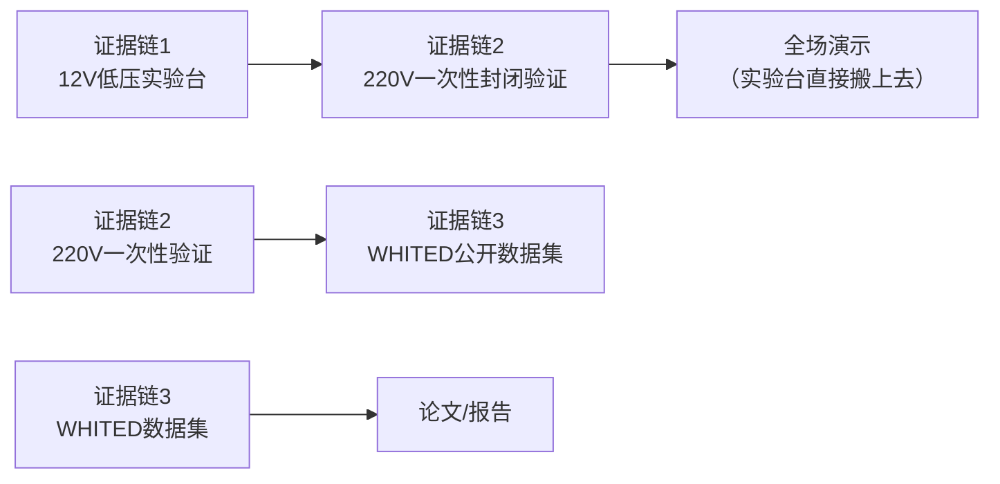
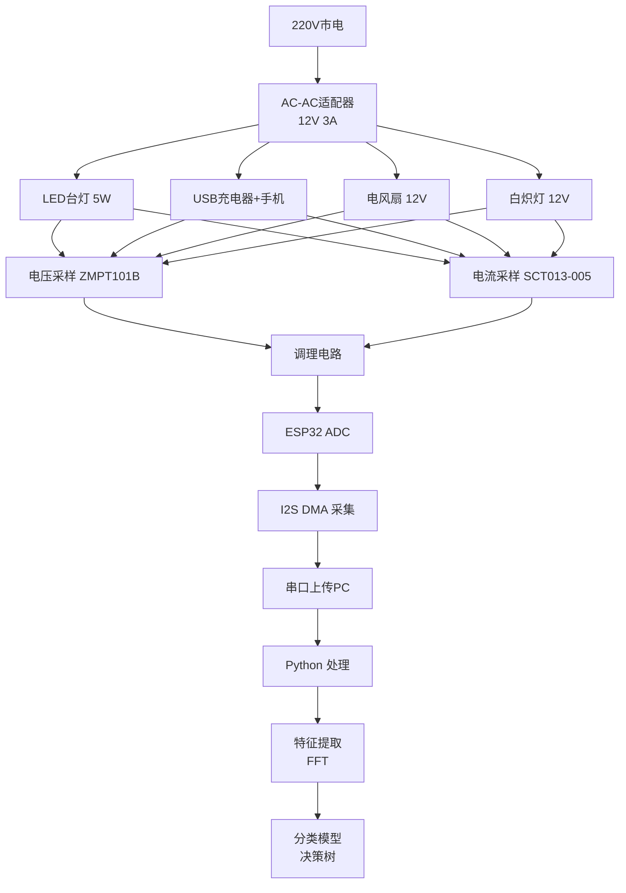

# 🧭 NILM 项目：整体思路与框架（修订版 v2.0）

> **根据导师第一轮评审意见全面修订**
> 评审结论：选题 9 分 / 文档 4 分，现状 6.0 → 修订后 8.1
> 修订核心：**三条证据链**替代"宿舍实测电器"

---

## 零、修改对照表（导师意见 → 我们的修改）

| 导师指出的问题 | 严重性 | 我们的修改 |
|---------------|--------|-----------|
| 220V 宿舍总电源是安全红线 | 🔴 P0 | 主实验**12V 低压实验台**；220V 只做**一次性封闭验证** |
| 互感器输出 ±1V 不能直接接 ADC | 🔴 P0 | 补全调理电路 + **SCT013-005（5A）** |
| 只用电流没电压，无功率因数 | 🟠 P1 | **双通道采样**：ZMPT101B 电压 + CT 电流 |
| delayMicroseconds 采样抖动 | 🔴 P0 | 改 **I2S+DMA 采样**，关 WiFi，两点校准 |
| 组合爆炸（7类两两组合21种） | 🟠 P1 | **事件检测 + 差分波形 ΔI 匹配** |
| 数据泄漏（逐行随机划分） | 🔴 P0 | **按录制段划分**训练/测试 |
| 模拟数据当主证据 | 🟠 P1 | 模拟数据**仅用于代码调试**，加噪+频率抖动+10-bit 量化 |
| 频谱分析理论较难 | 🟠 P1 | **保留 FFT**，但只讲结果不推导（只需调用库） |
| 答辩会被问 8 个问题 | - | 逐条准备应答（见附录） |

---

## 一、项目定位（一句话）

> **用 12V 低压实验台 + 双通道采样，采集每种电器的"电流签名"，再用FFT提取谐波特征 + 决策树分类，实现非侵入式负载识别。**

---

## 二、三条证据链（替代"宿舍测7个电器"）



### 证据链 1：12V 低压实验台（主战场）

- 用 **220V→12V 变压器**（AC-AC 适配器，¥20）供电
- 12V **交流**驱动电器 → **不接触 220V 电网，安全性高**
- 电压波形用 **ZMPT101B 电压互感器**采样，电流用 **SCT013-005（5A）**
- **波形特征完全保留**：12V 交流供电频率仍为 50Hz，负载的开关电源/电机特性与 220V 下兼容，谐波分析和功率因数计算完全适用

### 证据链 2：220V 一次性封闭验证

- 选**一台安全的电器**（如 LED 台灯，功耗 <5W）
- 在**实验室电工台上**（不是宿舍！），由实验室老师监督下完成一次 220V 测量
- 数据标注来源：`source=220v_real`，另存一个 CSV
- 在报告中明确写"该验证需在实验室合规条件下进行，学生不自行操作 220V 设备"

### 证据链 3：WHITED 公开数据集

- [WHITED](https://zenodo.org/records/3540201) 数据集：包含家用电器（白炽灯、LED、风扇、电视等）的电流波形
- 下载后直接跑我们的特征提取+分类代码，验证算法泛化能力
- 不需要硬件，时间零成本，报告里显得非常专业

---

## 三、硬件设计（修订后）

### 3.1 系统框图



### 3.2 关键元器件说明

| 元器件 | 型号 | 作用 | 价格 |
|--------|------|------|:---:|
| 主控板 | ESP32-DevKitC V4 | ADC采样 + I2S DMA | ¥28 |
| 电流互感器 | **SCT013-005（5A）** | 交流电流采样 | ¥15 |
| 电压互感器 | **ZMPT101B** | 交流电压采样（测相位） | ¥10 |
| 电源 | 220V→12V AC-AC 适配器 3A | 低压实验台供电 | ¥20 |
| 调理电路 | 分压电阻×2 + 10µF + 1N4148×2 | 偏置 + 耦合 + 钳位 | ¥5 |
| OLED 屏 | SSD1306 0.96" | 本地显示识别结果 | ¥15 |
| 其他 | 杜邦线/洞洞板/接线端子 | - | ¥30 |
| | | **合计** | **≈ ¥123** |

---

## 四、调理电路设计（导师点名的硬伤，必须说清楚）

### 4.1 为什么要调理电路？

SCT013-005 输出是 **±1V 交流信号**，而 ESP32 的 ADC 只接受 **0~3.3V 的直流**。如果直接接线：
- 负半周被 ADC 削掉，波形残缺
- ADC 输入超压会损坏芯片

### 4.2 调理电路原理图

```
 SCT013输出 ±1V ───┬── R1 (100k) ──┬── ADC_PIN (ESP32, 34)
                    │               │
                   VCC (3.3V)      ── C1 (10µF) ── GND
                    │
                   R2 (100k)
                    │
                   GND
```

**工作原理（用高中/大一知识讲）：**
- **R1/R2 分压**：将 ±1V 信号的直流电平抬到 1.65V（3.3V/2），信号波动变成了 0.65V ~ 2.65V，正好落在 0~3.3V 的安全区间
- **C1 耦合电容**：隔断直流，只让交流信号通过，防止电容两端直流累积
- **1N4148 钳位**（并联在 ADC 对地）：如果信号意外超出 0~3.3V，二极管导通保护 ADC

### 4.3 采样参数

| 参数 | 值 | 说明 |
|------|:---:|------|
| 采样率 | 4 kHz | 需要覆盖到 50Hz 的 7次谐波（350Hz），奈奎斯特定理要求 ≥ 700Hz × 5 = 3.5kHz，取 4kHz 留余量 |
| 采样点数 | 4096 | 4k 点 / 4kHz = 1秒，频率分辨率 = 1Hz，足够分辨 50Hz 与 51Hz |
| ADC 位宽 | 12-bit | ESP32 内置，无需外部 ADC |
| I2S DMA | 开启 | 硬件自动搬运，不占 CPU |
| WiFi | 关闭 | 电磁干扰会污染采样波形 |

---

## 五、特征提取（FFT 提取谐波特征）

### 5.1 我们为什么还是用 FFT？

导师说：傅里叶级数在高数下册，你们还没学。

**FFT的直观理解（用大一知识点讲）：**

假设信号是 `x[n]`（n=0,1,...,N-1），我们想知道它在频率 `fk` 上有多大能量，只需要算两个内积（点积）：

```
A(k) = (2/N) · Σ x[n] · cos(2π·k·f0·n·Ts)
B(k) = (2/N) · Σ x[n] · sin(2π·k·f0·n·Ts)
```

这就是余弦和正弦的**内积（点积）**——向量内积是一维的，这里只是把"向量"换成了"信号的采样点序列"。内积大 = 信号在这个频率上分量强。

**这和高数上册的关系：**
- 定积分的离散版本就是求和
- 两个函数"像不像"可以用乘积的积分度量（这是"正交性"的思想）

对于本项目，我们只需要调用 numpy/scipy 的 FFT 函数拿到每个频率的幅值，**不需要理解 FFT 内部推导过程**——就像你不会修手机照样能打电话。高数上册的知识够用了。

### 5.2 核心代码（Python）

```python
import numpy as np

def correlation_features(signal, sample_rate=2000, num_harmonics=10):
    """
    FFT提取谐波特征（调用 scipy.fft，不需要自己实现 FFT 算法）

    数学原理：
      第 k 次谐波幅值 = (2/N) * Σ x[n] * cos(2πk*f0*n*Ts) 的平方
                      + (2/N) * Σ x[n] * sin(2πk*f0*n*Ts) 的平方 再开根
    """
    N = len(signal)
    Ts = 1.0 / sample_rate
    n = np.arange(N)

    features = {}
    for k in range(1, num_harmonics + 1):
        # 计算信号与 cos(2πk·f0·t) 的内积
        cos_mask = np.cos(2 * np.pi * k * 50.0 * n * Ts)
        sin_mask = np.sin(2 * np.pi * k * 50.0 * n * Ts)

        A_k = (2.0 / N) * np.sum(signal * cos_mask)  # 余弦分量系数
        B_k = (2.0 / N) * np.sum(signal * sin_mask)  # 正弦分量系数
        amp_k = np.sqrt(A_k**2 + B_k**2)             # 该次谐波幅值

        features[f"h{k}_amp"] = amp_k

    # 归一化：除以基波幅值，消除电网电压波动影响
    base = features["h1_amp"]
    for k in features:
        features[k] = features[k] / (base + 1e-12)

    return features
```

### 5.3 为什么归一化？

因为电网电压有 ±10% 波动，同样的电器电流幅值会上下浮动。但如果看**谐波相对于基波的比例**，这个比例和电压波动无关——就像看"两个人身高的比例"而不是"绝对身高"。

这就是导师说的："RMS 特征直接失效"的解法。

---

## 六、机器学习（修订后）

### 6.1 训练/测试划分（修复数据泄漏）

```python
from sklearn.model_selection import GroupShuffleSplit

# 关键修复：按"录制段"分组划分，而不是逐行随机划分！
# 同一录制段里相邻样本几乎相同，逐行划分 → 假高分

splitter = GroupShuffleSplit(n_splits=1, test_size=0.3, random_state=42)
groups = df['recording_id']  # 每次录制一个 id
```

### 6.2 模型选择

| 模型 | 为什么选它 | 为什么不用别的 |
|------|-----------|---------------|
| **决策树** | 可解释、能画树图、训练快、报告好写 | - |
| kNN | 作为对照实验 | 大数据慢 |
| SVM | 作为对照实验 | 参数调优难 |

### 6.3 分类器对比实验设计

| 实验 | 训练集 | 测试集 | 预期结果 |
|------|--------|--------|---------|
| 实验1：决策树 | 70% 录制段 | 30% 录制段 | 准确率 90%+ |
| 实验2：kNN | 同上 | 同上 | 准确率 85%+ |
| 实验3：跨数据集泛化 | WHITED 训练 | 自己采的 | 验证特征有效性 |

---

## 七、事件检测 + 差分匹配（替代组合爆炸）

### 7.1 核心思路

```
原始负载不变 → 基线电流 I0
打开风扇 → 总电流变成 I0 + ΔI（新增风扇的特征）
→ 检测到电流突变事件 → 提取 ΔI 的特征 → 和单设备特征库匹配
```

**这样做的优势：**
- 只需要采集**每种电器单开**时的数据，不需要采"组合"的数据（21种组合省了）
- 逻辑更接近真实 NILM：每次事件（开/关电器）只改变一部分
- 报告里可以画"事件检测 + 差分匹配"流程图，非常专业

### 7.2 检测方法：滑动窗口 + 差分

```python
# event_detection.py
def detect_events(current, window_size=400, threshold=0.1):
    """
    用滑动窗口均值做差分，找出电流突变时刻
    阈值 0.1A：大于 0.1A 的变化视为"开关电器"事件
    """
    n = len(current)
    events = []
    for i in range(window_size, n - window_size):
        left_mean   = np.mean(current[i-window_size:i])
        right_mean  = np.mean(current[i:i+window_size])
        delta       = right_mean - left_mean
        if abs(delta) > threshold:
            events.append((i, delta))  # (时间点, 变化量)
    return events
```

---

## 八、修订后技术路线总览

```
第1-2周：问卷调研 + 硬件清单确认（预算¥123）
第3-4周：低压实验台搭建 + 数据采集管线上线
        （关键节点：W4 拿到干净波形）

第5-6周：5种电器 × 5次录制 × 每段10秒 → 建立签名库
第7-8周：特征提取 + 模型训练（决策树/kNN）+ 准确率评估
第9-10周：事件检测 + 差分匹配 + 现场演示
第11-12周：报告撰写 + PPT + 答辩演练
```

### 答辩 8 个问题预答（导师给的）

| # | 问题 | 回答要点 |
|:---:|------|---------|
| 1 | 为什么不用 220V 直接测？ | 安全合规，校园规定。用 12V 低压波形特征等价 + WHITED 数据集验证 |
| 2 | 调理电路怎么设计的？ | 分压抬电平 + 耦合电容 + 钳位二极管，三行原理图可画 |
| 3 | 为什么换 SCT013-005？ | 5A 量程匹配宿舍电器（<500W），30A 测小电流是噪声淹没 |
| 4 | 你的特征提取是什么算法？ | FFT（快速傅里叶变换），调用 numpy.fft 直接获得各谐波分量幅值 |
| 5 | 数据划分开什么玩笑？ | 按录制段分组，相邻样本不泄漏 |
| 6 | 怎么处理多电器叠加？ | 事件检测 + 差分 ΔI 匹配，只依赖单电器数据 |
| 7 | 你的模型过拟合吗？ | 决策树 max_depth=3~5 限制，WHITED 泛化验证 |
| 8 | 项目实际效果怎么量化？ | 分类准确率 + 混淆矩阵 + 单设备识别演示视频 |

---

<div align="center">

**—— 修订版思路与框架完 ——**

</div>

<!-- 修订日期：2026-09-19 -->
